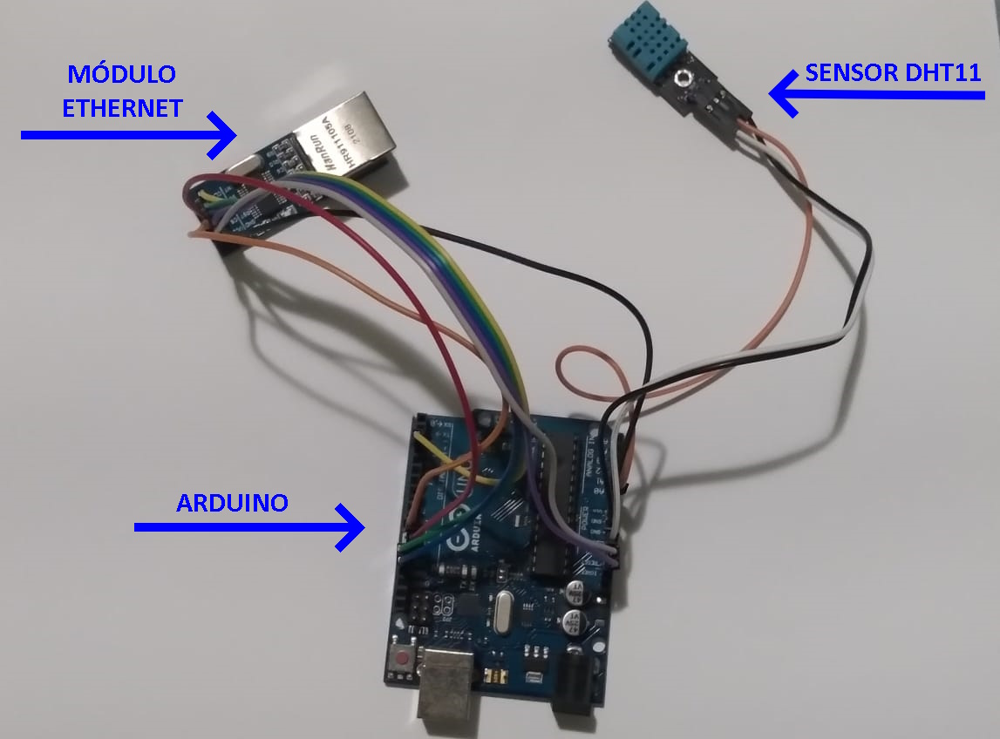
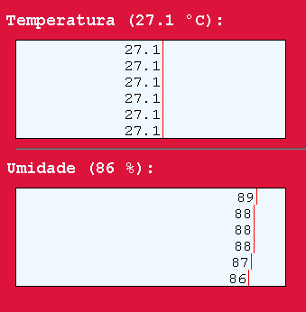

# Climer

<div>
	
	
	
</div>

## O Projeto

Uma aplicação que utiliza um sensor para medir a temperatura e umidade local, e atualiza em uma página Web.

## Tecnologias Utilizadas

| Tecnologias | Funções |
| --- | --- |
| Arduino |
|  |  _* DHT11_<br/>Sensor de __temperatura__ e __umidade__ local |
|  | _* Módulo Ethernet ENC28j60_<br/>Módulo de conexão Ethernet, envia a requisição http para a rede |
|  | _* Arduino Uno_<br/>Microcontrolador que recebe os dados  |
|  | _* C++_<br/>Linguagem de Programação usada para "controlar" a placa Arduino |
| Servidor |
|  | _* Go_<br/>Linguagem de Programação usada para estruturar o servidor __HTTP__ e conexões __WebSocket__ |
| Front-End |
|  | _* HTML_<br/>Estruturar os componentes das páginas WEB |
|  | _* CSS_<br/>Estiliza os componentes das páginas HTML |
|  | _* JavaScript_<br/>Linguagem de Programação usada para configurar o cliente WebSocket e dinamiza a página HTML |

## Funcionamento

#### Arduino
O Arduino através das bibliotecas *DHT* coleta os dados de __Umidade__ e __Temperatura__ do sensor DHT11, e com a biblioteca *UIPEthernet* monta uma requisição HTTP e envia para a rede quando o IP for acessado.



```c++
// Montagem da Requisicao http em formato JSON
client.println("HTTP/1.1 200 OK");
client.println("Content-Type: application/json");
client.println();
client.print( "{\"umidade\":" );
client.print( h );
client.print( ",\"temperatura\":" );
client.print( t );
client.println( '}' );
client.stop();
```

#### Servidor
Com a linguagem __Go__ é criado uma rota para servir os arquivos estáticos, e outra para responder a conexão de um cliente WebSocket.

Outro método funcionando em uma Corrotina faz um looping infinito, que a em um intervalo definido (por enquanto 5 segundos) chama outra função responsável por enviar uma requisição http para o IP do arduino, processar os dados recebidos em JSON e enviar para todos o clientes conectados por WebSocket.

```go
// Estrutura Go que processa os dados recebidos do Arduino
type Climer struct {
	Temperatura float32 `json:"temperatura"`
	Umidade		float32 `json:"umidade"`
}
```

#### Front-End
O Código Javascript abre conexão com o servidor WebSocket como cliente, e sempre que recebe alguma mensagem, atualiza diretamente na página HTML na forma de um simples gráfico de barras.

